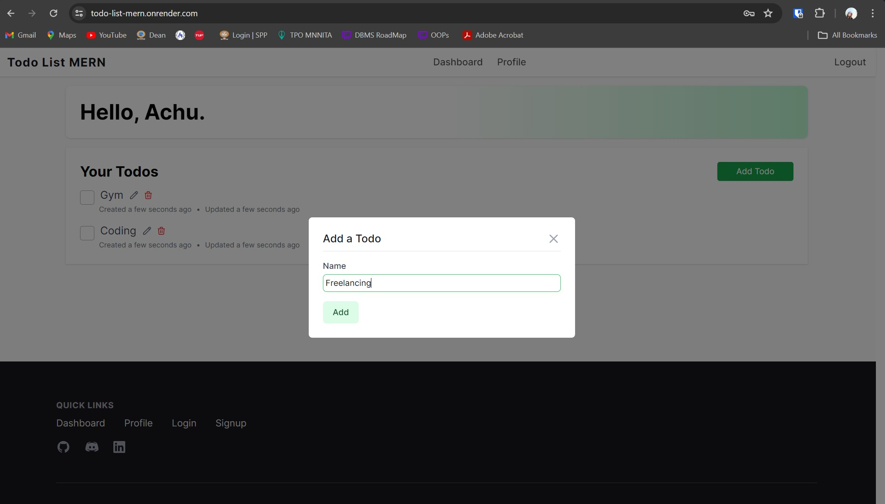
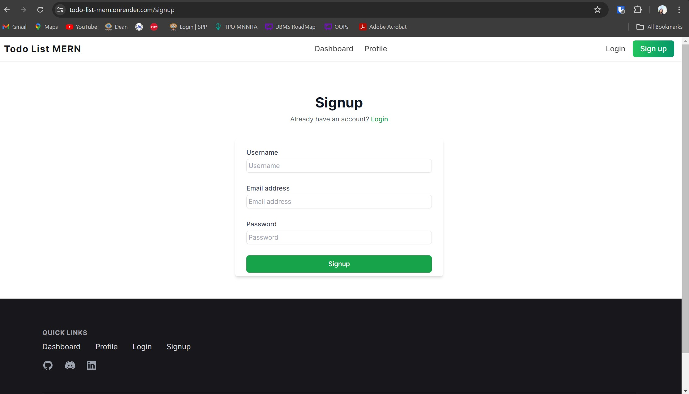
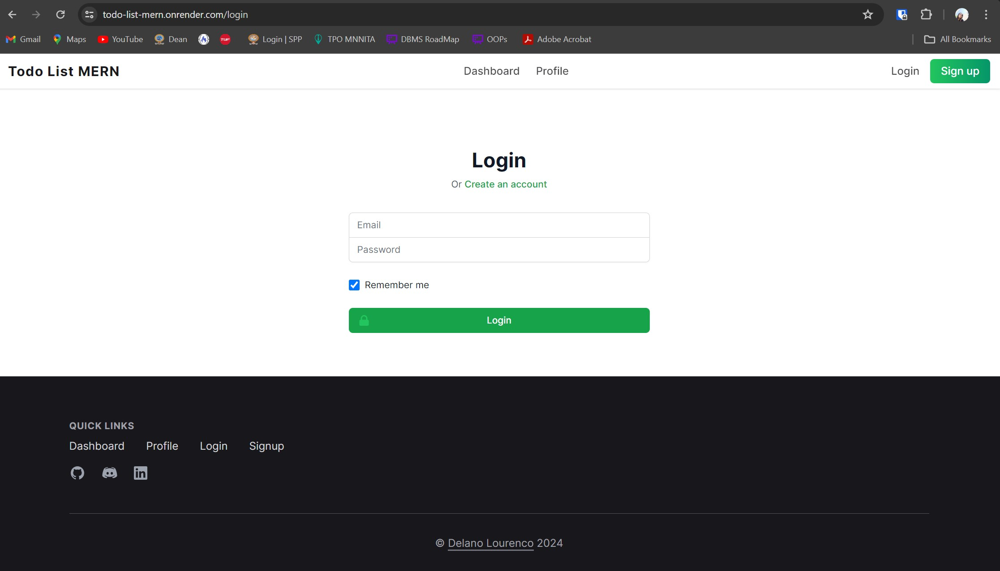
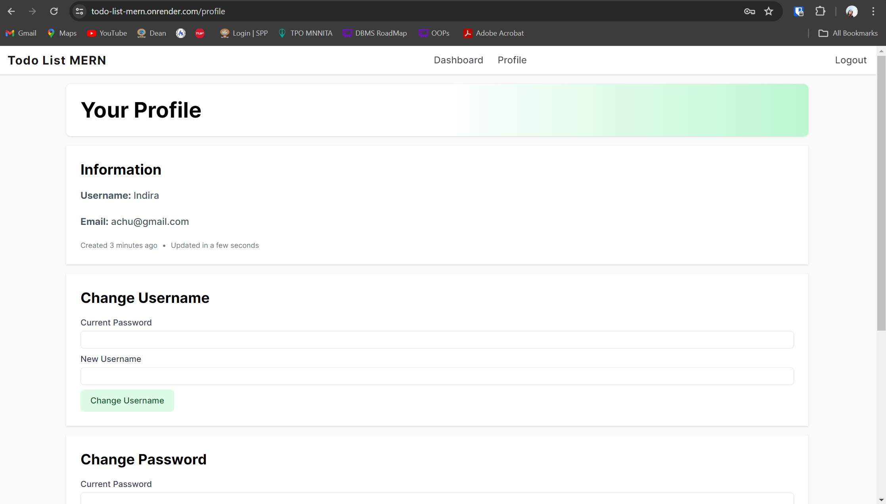

Todo Application Using MERN
=========================================

### A todo list made using MERN stack with user authentication.

<br>
<p>
   
</p>

# Screenshots





# Features
--------------

- User authentication with persistent Todos
- Responsive TailwindCSS design
- RESTful API
- Body / Params type checking

# Installation
Run the following command to clone the repository
```
# Clone
https://github.com/indiragothi/ToDo-App-For-Rise11
```
# Configuration
Create ```.env``` file inside ```backend``` directory and copy the following code

```
MONGO_URI=Your mongodb URI
GMAIL_USERNAME=your gmail address 
GMAIL_PASSWORD=password created inside 'App Password' section under google accounts setting
PORT=8000
JWT_SECRET=a random secret key eg. thisisasecretkey
```
# Run the App
Go to ```backend``` and ```frontend``` directory and start the server
```
cd backend
nodemon server
```
```
cd frontend
npm start
```
# Technologies Used

Review-System utilizes the following technologies:
- **Node.js:** JavaScript runtime for server-side development.
- **Express.js:** Web application framework for Node.js, facilitating API development.
- **React.js** Frontend library for building the user interface.
- **MongoDB:** NoSQL database for storing review data.
- **JWT:** JSON Web Tokens for authentication and authorization.
- **Tailwind CSS:** Utility-first CSS framework for styling components.
- **Redux:** State management library for handling application state.
- **Other Node.js packages:** Various npm packages for additional functionalities.
 